<Info>
  This guide helps you install and configure Meeseeks as quickly as possible.
</Info>

<Steps>

<Step title="Add the dependency">
To integrate Meeseeks into your project, add the dependency.

<CodeGroup>

```toml Gradle Version Catalogs
  [versions]
  meeseeks = "1.0.0"

  [libraries]
  meeseeks-runtime = { group = "dev.mattramotar.meeseeks", name = "runtime", version.ref = "meeseeks" }
```

```kotlin Kotlin DSL
  kotlin {
    sourceSets {
        commonMain {
            dependencies {
                implementation(libs.meeseeks.runtime)
                // or
                implementation("dev.mattramotar.meeseeks:runtime:1.0.0")
            }
        }
    }
  }
```

```groovy Groovy DSL
implementation "dev.mattramotar.meeseeks:runtime:1.0.0"
```

</CodeGroup>

</Step>

<Step title = "(iOS Only) Register BGTaskScheduler Identifiers">

In your `Info.plist` file, add the following:

```xml
<key>BGTaskSchedulerPermittedIdentifiers</key>
<array>
  <string>dev.mattramotar.meeseeks.periodic.task</string>
  <string>dev.mattramotar.meeseeks.onetime.task</string>
</array>
```

</Step>

<Step title="Initialize Meeseeks">

<CodeGroup>

```kotlin Android
class MyApp : Application(), MeeseeksContext {
   override fun onCreate() {
    initializeMeeseeks()
  }

  private fun initializeMeeseeks() {
    val config = MeeseeksBoxConfig(
      maxParallelTasks = 2,
      backoffMinimumMillis = 10000
    )

    return Meeseeks.initialize(
        context = this,
        config = config
    ) {
      register(MeeseeksType.SYNC) { task -> SyncingMeeseeks(task) }
      register(MeeseeksType.POLL) { task -> PollingMeeseeks(task) }
    }
  }
}
```

```java JVM
public class Main implements MeeseeksContext {
  public static void main(String[] args) {
    MeeseeksBoxConfig config = new MeeseeksBoxConfig(
        2,      // maxParallelTasks
        false,   // allowExpedited
        3,      // maxRetryCount
        10000   // backoffMinimumMillis
    );

    Meeseeks.initialize(
        new Main(),
        config,
        registryBuilder -> {
            registryBuilder.registerFactory(MeeseeksType.SYNC, task -> new SyncingMeeseeks(task));
            registryBuilder.registerFactory(MeeseeksType.POLL, task -> new PollingMeeseeks(task));
        }
    );
  }
}
```

```swift Native (iOS)
@main
class AppDelegate: UIResponder, UIApplicationDelegate, MeeseeksContext {
  func application(
    _ application: UIApplication,
    didFinishLaunchingWithOptions launchOptions: [UIApplication.LaunchOptionsKey: Any]?
  ) -> Bool {
    let config = MeeseeksBoxConfig(
      maxParallelTasks: 2,
      backoffMinimumMillis: 10000
    )

    Meeseeks.companion.initialize(
      context: self,
      config: config
    ) { registry in

      registry.registerFactory(type: MeeseeksType.SYNC) { task in
        SyncingMeeseeks(task: task)
      }
      registry.registerFactory(type: MeeseeksType.POLL) { task in
        PollingMeeseeks(task: task)
      }
    }

    BGTaskScheduler.shared.register(
      forTaskWithIdentifier: "dev.mattramotar.meeseeks.periodic.task", 
      using: nil
    ) { identifier in
      MeeseeksBGTaskRunner.run(bgTaskIdentifier: identifier, taskSchedule: TaskSchedule.Periodic())
    }

    BGTaskScheduler.shared.register(
      forTaskWithIdentifier: "dev.mattramotar.meeseeks.onetime.task", 
      using: nil
    ) { identifier in
      MeeseeksBGTaskRunner.run(bgTaskIdentifier: identifier, taskSchedule: TaskSchedule.OneTime())
    }

    return true
  }
}
```

```kotlin JS (Web)
import dev.mattramotar.meeseeks.runtime.*
import dev.mattramotar.meeseeks.runtime.dsl.registry.MeeseeksRegistryBuilderExtensions.register
import kotlinx.browser.window
import kotlin.js.Date

object BrowserContext : MeeseeksContext

fun main() {
    val config = MeeseeksBoxConfig(
        maxParallelTasks = 2,
        backoffMinimumMillis = 10000
    )

    Meeseeks.initialize(
        context = BrowserContext,
        config = config
    ) {
      register(MeeseeksType.SYNC) { task -> SyncingMeeseeks(task) }
      register(MeeseeksType.POLL) { task -> PollingMeeseeks(task) }
    }

    if (js("('serviceWorker' in navigator)") as Boolean) {
    window.navigator.serviceWorker
        .register("/service-worker.js")
        .then { console.log("Service Worker registered!") }
        .catch { err -> console.warn("SW registration failed: ${err}") }
    }
}
```

</CodeGroup>
</Step>

<Step title="(JS Only) Service Worker Setup">

If your browser supports [Background Sync](https://developer.mozilla.org/en-US/docs/Web/API/Background_Sync_API) or [Periodic Background Sync](https://developer.mozilla.org/en-US/docs/Web/API/Web_Periodic_Background_Synchronization_API), you can handle tasks even when the tab isn't active.

Example `service-worker.js`:

```js
self.addEventListener('sync', event => {
  if (event.tag && event.tag.startsWith("meeseeks-")) {
    event.waitUntil(handleSync(event.tag));
  }
});

self.addEventListener('periodicsync', event => {
  if (event.tag && event.tag.startsWith("meeseeks-")) {
    event.waitUntil(handleSync(event.tag));
  }
});

async function handleSync(tag) {
  if (self.MeeseeksBGTaskRunner && self.MeeseeksBGTaskRunner.run) {
    await self.MeeseeksBGTaskRunner.run(tag);
  }
};
```

<Alert> If a browser doesn't support service workers or background sync, Meeseeks falls back to in-memory scheduling that runs only while the page is open.</Alert> 

</Step>

<Step title="Get the Meeseeks box">

The `MeeseeksBox` is the global manager of all scheduled tasks. It is what you need to summon a `MrMeeseeks`.

```kotlin
val meeseeksBox = MeeseeksBox.value
```

</Step>

<Step title="Define a task">
```kotlin
val task = Task(
  MeeseeksType.SYNC,
  parameters = taskParametersOf {
    KEY_USER_ID to "RICKC137"
    KEY_DIMENSION_ID to 137
    KEY_SYNC_PROTOCOL to SyncProtocol.INTERDIMENSIONAL
    KEY_COUNCIL_OVERRIDE to true
    KEY_USER_TAGS toList {"portal-gun-user"}
  },
  preconditions = TaskPreconditions(
    requiresNetwork = true,
    requiresCharging = false,
    requiresBatteryNotLow = false
  ),
  priority = TaskPriority.HIGH,
  schedule = TaskSchedule.Periodic(interval = 60.seconds),
  retryPolicy = TaskRetryPolicy.ExponentialBackoff(initialDelay = 1.seconds, maxRetries = 3)
)
```
</Step>

<Step title="Summon a Meeseeks">

Meeseeks will execute the task in the background.

```kotlin
val meeseeksId = meeseeksBox.summon(task)
```

</Step>

</Steps>

---

<Note>
  Explore advanced usage like custom preconditions, advanced concurrency, or
  building your own <code>MrMeeseeks</code> in the{" "}
  <a href="/docs/advanced/overview">Advanced Docs</a>.
</Note>

## Frequently asked questions

<AccordionGroup>
  <Accordion title="How does Meeseeks store and persist tasks?">
    Meeseeks uses a local SQLDelight database to store all task data (including
    parameters, schedule, status, logs). Each platform has a driver for that database, so your tasks are persisted across
    app restarts or process deaths.
  </Accordion>
  <Accordion title="What happens to tasks if my app is force-closed or the device reboots?">
    Because tasks and their metadata live in a local database, Meeseeks can
    reconstruct and re-schedule them when your app restarts. 
    - `Android`: `WorkManager` automatically
    re-schedules tasks after a reboot if you configure it to do so. 
    - `JVM`: Tasks are re-scheduled with `Quartz` the next time your application launches and re-initializes Meeseeks.
    - `Native (iOS)`: Tasks are re-scheduled with `BGTaskScheduler` the next time your application launches and re-initializes Meeseeks.
    - `JS (Web)`: If you used `SyncManager` or `PeriodicSyncManager`, the browser may continue to run tasks via the `ServiceWorker` in the background (user permissions and browser support permitting). Otherwise, tasks do not continue to run after the page is closed, but will be re-scheduled when the page is opened again.
  </Accordion>
  <Accordion title="How does Meeseeks handle concurrency across platforms?">
    - `Android`: Concurrency is delegated to `WorkManager` which manages parallel
    tasks according to OS constraints. 
    - `JVM`: Concurrency is similarly delegated to `Quartz`.
    - `Native (iOS)`: Uses `BGTaskScheduler` for periodic and one-time tasks. Tasks are canceled or updated locally in the DB, and on iOS 16+ can be canceled programmatically via `cancelTaskRequestWithIdentifier`.
    - `JS (Web)`: Uses `ServiceWorker` `sync`/`periodicsync` if available, otherwise in-memory timers. 

  </Accordion>
  <Accordion title="  What if I need to cancel or update a task after summoning it?">
    You can call `MeeseeksBox.sendBackToBox(id)` to cancel a task by its
    `MrMeeseeksId`. This removes or cancels its scheduled job and updates the
    database so it will not be run again. For updating a task’s data (such as
    its schedule or priority), you will need to cancel the existing one and
    summon a new Meeseeks with the updated `Task`.
  </Accordion>
  <Accordion title="How do I track the status of a task?">
    Meeseeks provides APIs to query a task's current status at any time:
    - `MeeseeksBox.getStatus(taskId)` returns the `TaskStatus` of a single task, or `null` if that task does not exist.
    - `MeeseeksBox.getAllTasks()` returns a list of `ScheduledTask` objects, each containing the task’s `MrMeeseeksId`, `TaskStatus`, and other metadata (like run attempt count).
    - `MeeseeksBox.watchStatus(taskId)` provides a reactive stream of `TaskStatus` changes.
  </Accordion> 

  <Accordion title="How does Meeseeks handle different scheduling intervals?">
Tasks specify a `TaskSchedule`, which can be: 
      - `TaskSchedule.OneTime`
      - `TaskSchedule.Periodic`

On Android, `PeriodicWorkRequests` are used under the hood. On iOS, `BGAppRefreshTaskRequest` and `BGProcessingTaskRequest` are used under the hood.

  </Accordion>

  <Accordion title="What are some examples of setting different scheduling intervals?">

    <Tabs>

      <Tab title="One-Time Task">
        ```kotlin
          val oneTimeSyncTask = Task(
            MeeseeksType.SYNC,
            schedule = TaskSchedule.OneTime(
              initialDelay = 0
            )
          )

          val meeseeksId = MeeseeksBox.value.summon(oneTimeSyncTask)
        ```

      </Tab>

      <Tab title="Periodic Task">

        <Warning>
          Periodic tasks on some platforms require a minimum interval. For example on
          Android, [WorkManager has a minimum interval of 15
          minutes](https://developer.android.com/develop/background-work/background-tasks/persistent/getting-started/define-work#schedule_periodic_work).
        </Warning>

        ```kotlin
          val periodicSyncTask = Task(
            MeeseeksType.SYNC,
            schedule = TaskSchedule.Periodic(
              interval = 15.minutes,
              flexWindow = 60.seconds
            )
          )

          val meeseeksId = MeeseeksBox.value.summon(periodicSyncTask)
        ```

      </Tab>

    </Tabs>

  </Accordion>  
  <Accordion title="Do I need network connectivity for tasks to run?">
    It depends on your `TaskPreconditions`. For instance, if `requiresNetwork =
    true`, the task will not be run unless a network is available.
  </Accordion>
  <Accordion title="What are some best practices for setting retry policies?">
  - Use exponential backoff (`TaskRetryPolicy.ExponentialBackoff`) for
      network-related tasks. This prevents tight loops and reduces server/battery
      load. 
  - Limit max retries to avoid infinite attempts. 
  - Use fixed intervals (`TaskRetryPolicy.FixedInterval`) if you’re sure the operation should repeat in consistent time blocks. 
  - Log failed attempts thoroughly so you can identify repeated failures.
  </Accordion>
  <Accordion title="What if I need platform-specific logic in my background tasks?">
    Because Meeseeks is a Kotlin Multiplatform library, you can implement a
    `MeeseeksFactory` that provides platform-specific code. For example, if you
    need iOS-specific APIs, you could use `expect/actual` classes or call Swift
    code from your iOS target. The library only orchestrates scheduling and
    persistence. What the `MrMeeseeks` does inside `execute()` is up to you.
  </Accordion>
  <Accordion title="How do TaskStatus state transitions work?">
    Meeseeks uses `TaskStatus` to represent the lifecycle of tasks:
    - **Pending**: The task is scheduled but not currently running. 
    - **Running**: The task is actively executing.
    - **Finished**: A terminal state indicating no further runs. It may be:
      - **Completed** (successful) 
      - **Cancelled** (manually cancelled or platform removed it) 
      - **Failed** (permanently failed)

    When a task runs, if it returns:
    - `TaskResult.Success`: Meeseeks sets the task status to `Finished.Completed`.
    - `TaskResult.Retry` or `TaskResult.Failure.Transient`: Meeseeks reverts the task status to `Pending` so that it can be retried later (respecting any backoff or retry policy).
    - `TaskResult.Failure.Permanent`: Meeseeks sets the task status to `Finished.Failed`, meaning no more attempts will be scheduled.
    
    Conceptually, you can visualize these transitions:

    <div style={{width: '50%'}}>
      
    </div>

    If a task is canceled via `MeeseeksBox.sendBackToBox`, it transitions to `Finished.Cancelled`. For tasks that fail with a transient error (e.g., network unavailable), the status simply goes back to `Pending` until the next run attempt.
  </Accordion>
</AccordionGroup>

## Next steps

<Check>
  Yes siree! You've successfully initialized Meeseeks, configured your first
  tasks, and seen how to track results. Use the resources below to keep
  learning.
</Check>

<CardGroup cols={3}>
  <Card
    title="Concepts"
    icon="book"
    iconType="duotone"
    href="/docs/concepts/overview"
  >
    Learn how tasks, scheduling, concurrency, and logging really work under the
    hood.
  </Card>
  <Card
    title="Advanced usage"
    icon="wand-magic-sparkles"
    iconType="duotone"
    href="/docs/advanced/overview"
  >
    Build custom Meeseeks, handle special concurrency cases, or dive into
    debugging tasks.
  </Card>
  <Card
    title="Community"
    icon="users"
    iconType="duotone"
    href="https://github.com/"
  >
    Contribute, ask questions, or file issues on our GitHub repo.
  </Card>
</CardGroup>
